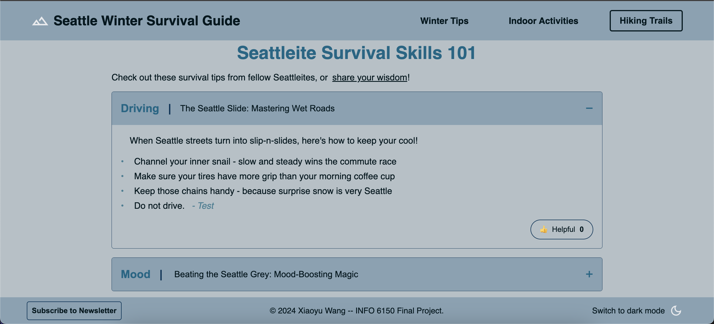

# Seattle Winter Guide
**Author**: xiaoyuwang0314  
**Date**: 2024-12-06  
**Course**: INFO 6150 - NEU  
**Project**: Final Project

**Live Demo**: [https://web-design-and-user-experience-engineering.vercel.app](https://web-design-and-user-experience-engineering.vercel.app)

**Seattle Winter Survival Guide** is a frontend web application built with **React** and **Vite**, designed to showcase responsive UI design, interactive components, and accessibility features without backend dependencies.

This single-page application helps users discover indoor activities and survival tips during Seattle's rainy winter season. This README.md file will briefly introduce the features and some known limitations of the project to help users navigate and interact with the application.

### Screenshots
Here are some screenshots that demonstrate the visual effects and functionality of the project:

 

 

## Features

### 3 “Pages”
1. **Welcome Page**: Click logo or "Seattle Winter Survival Guide"
2. **Indoor Activities**: Click "Indoor Activities" in the header
3. **Winter Tips**: Click "Winter Tips" in the header

### Key Features

1. **Adaptive Hamburger Menu**: Appears on mobile devices (50rem and below)
2. **Dropdown Navigation Menu**: "Hiking Trails" dropdown menu with 4 links in the header
3. **Theme Selection**
   - Toggle between light and dark themes in the right corner of the footer
   - different pictures for light and dark themes in the welcome page
   - applied to all pages and components
4. **Cards with Images**
   - Each card contains links to 2 recommended locations in Seattle
   - All links have been verified as active (at the time of submission, 2024-12-04)
5. **Accordions**
   - Collapsible sections for winter survival tips
   - "helpful" button for each tip
   - "share your wisdom" button at the top of the accordions page
6. **Complex Form**
   - "subscribe" button in the left corner of the footer and the last paragraph of the welcome page
   - Conditional fields based on user input (if the checkbox is checked, the comments field is required). 
   -The form will close after submitting.

7. **A Dialog Modal**
   - Please click the "share your wisdom" button in the accordions page to share your tips
   - Submitted content appears dynamically under the selected category
   - Form data is processed in-memory using object indexing and rendered with `.map()`
   - **Note**: This feature is frontend-only, but can be easily extended by connecting to a backend service (e.g., REST API + database) to persist user-submitted tips.

### Extra Features (for fun...)

**Upvote button**
   - UI: Upvote (👍) button for each tip in the accordions page
   - Known limitation: Users can only vote once, so vote count is limited to 0 or 1... But I think it's fine for a font-end project, it can be improved with backend and database to store vote count from multiple users.

### Some known limitations
- **Header**: The "Hiking Trails" dropdown menu is implemented as a dropdown button. However, from a design perspective, placing it parallel to other navigation links can appear somewhat awkward.
- **CSS Organization**: 
  - Initially planned to organize styles by light theme, dark theme, and media queries
  - Code organization became less structured during development iterations
  - Some class names were updated, but there might be legacy styles that weren't fully cleaned up, took some time to figure out which styles are used and which are not.
- **Picture**: almost downloaded by random, without considering about color design...
- **Color**: Despite multiple revisions, the color choices remain suboptimal due to the author's limited aesthetic sense.

### Accessibility
- Semantic HTML structure
- ARIA labels where needed
- Keyboard navigation support
- Skip link implementation
- Color contrast compliance
- Responsive font sizes in rem units

### Responsive Design
- Mobile-first approach
- Breakpoints at 38rem and 60rem (cards page), and 50rem (other pages), 
- Fluid layouts and flexible images
- Adaptive navigation menu and footer

## Image Credits
See `licenses.txt` for detailed attribution of all images used in this project.

## Running the Project
1. Install dependencies:

```bash
npm install
```

2. Build the project:

```bash
npm run build
```

3. Serve the built files:

```bash
npx serve -s dist
```
